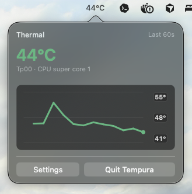

# Tempura

Tempura is a native macOS menu bar utility that shows one representative hardware temperature in Celsius.



## Download

Download the latest release:

[Tempura 0.2.0](https://github.com/TthBnc/tempura/releases/tag/v0.2.0)

Install from the DMG:

1. Download `Tempura.dmg` from the release page.
2. Open the DMG.
3. Drag `Tempura.app` onto the `Applications` shortcut.
4. Launch Tempura from Applications or Spotlight.

Tempura is currently ad-hoc signed, not notarized with Apple Developer ID, so macOS may ask you to confirm before opening it.

## What It Does

- Shows a live Celsius temperature in the macOS menu bar.
- Opens a compact panel with the last 60 seconds of local thermal history.
- Colors readings by temperature range.
- Can open automatically when you log in.
- Shows version details and opens the latest release page from a separate settings window when requested.
- Provides a `Quit Tempura` button in the panel.
- Prevents duplicate app instances.
- Stays local-only while monitoring: no background network calls, telemetry, fan control, or SMC writes.

## Build From Source

Run the sensor probe first:

```sh
swift run tempura-probe
```

Build the menu bar app bundle:

```sh
./Scripts/build_app.sh
```

The bundle is written to:

```text
.build/app/Tempura.app
```

The app icon is generated from `Assets/AppIcon.svg` into a macOS `.icns` file during the app build.

Build a local drag-install DMG:

```sh
./Scripts/build_dmg.sh
```

The DMG is written to:

```text
dist/Tempura.dmg
```

Open it, then drag `Tempura.app` onto the `Applications` shortcut.

## Development Run

For quick iteration, the executable can run directly:

```sh
swift run Tempura
```

The packaged app is preferred for daily use because `Packaging/Info.plist` sets `LSUIElement` so the app does not appear in the Dock or app switcher.

## Notes

- Reads local SMC temperature values through IOKit.
- Displays the hottest valid CPU/GPU/SoC-adjacent reading when available.
- Falls back to the hottest valid known or scanned temperature reading.
- Polls every 5 seconds.
- Shows `--°C` when no valid sensor is available.

## License

Tempura is released under the MIT License. It is provided as-is, without warranty or liability. See `LICENSE`.

Tempura adapts read-only SMC access patterns and temperature sensor key mappings from Stats. See `THIRD_PARTY_NOTICES.md`.
